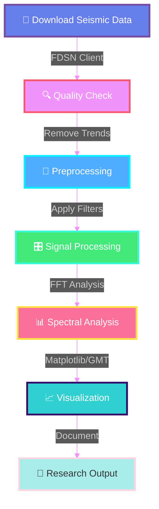

<div align="center">

<!-- Animated Header -->


<!-- Animated Typing Effect -->


<br/>

<!-- Animated Badges -->
<p align="center">
  
  
  
  
  
</p>

<!-- Animated Stats -->
<p align="center">
  
  
  
  
</p>

<!-- Animated Divider -->


### 🎓 Hands-on Codes, Workflows & Assignments
*Reproducible Research-Oriented Workflows in Seismology & Geophysics*

<br/>

<!-- Navigation Buttons -->
[](#-objectives)
[](#-tools--tech-stack)
[](#-course-topics)
[](#-getting-started)

</div>

---

<br/>

## 🎯 Objectives

<div align="center">

<table>
<tr>
<td align="center" width="33%">

<h3>🔬 Master Terminal Tools</h3>
<p>Command-line seismic data analysis using Ubuntu Linux & professional workflows</p>
</td>
<td align="center" width="33%">

<h3>📊 Process Waveforms</h3>
<p>Advanced filtering, spectral analysis & signal processing techniques</p>
</td>
<td align="center" width="33%">

<h3>📝 Build Workflows</h3>
<p>Reproducible pipelines for research publications with Git version control</p>
</td>
</tr>
</table>

</div>

<br/>

<div align="center">

</div>

<br/>

## 🛠 Tools & Tech Stack

<div align="center">

### 💻 Core Technologies

<table>
<tr>
<td align="center" width="20%">

<br><b>Python</b>
<br><sub>ObsPy, NumPy, SciPy</sub>
</td>
<td align="center" width="20%">

<br><b>Linux</b>
<br><sub>Ubuntu Terminal</sub>
</td>
<td align="center" width="20%">

<br><b>SAC</b>
<br><sub>Seismic Analysis</sub>
</td>
<td align="center" width="20%">

<br><b>Git & GitHub</b>
<br><sub>Version Control</sub>
</td>
<td align="center" width="20%">

<br><b>Bash</b>
<br><sub>Shell Scripting</sub>
</td>
</tr>
</table>

### 📊 Analysis & Visualization

```python
# Primary Python Libraries
import obspy          # Seismic data processing
import numpy          # Numerical computations  
import scipy          # Signal processing
import matplotlib     # Data visualization
```


</div>

<br/>

<div align="center">

</div>

<br/>

## 📚 Course Topics

<div align="center">

### 🎓 Complete Semester Curriculum

</div>

<details>
<summary><b>📖 Module 1: Foundations of Seismology</b></summary>

<br/>

- 🌍 **Introduction to Seismology**
  - Earthquake science fundamentals
  - Seismic waves and wave propagation
  - Global seismicity patterns
  
- 🖥️ **Linux & Command-Line Mastery**
  - Ubuntu terminal essentials
  - File system navigation
  - Bash scripting basics
  
- 🔧 **Version Control with Git**
  - Git fundamentals
  - GitHub workflows
  - Collaborative development

</details>

<details>
<summary><b>📡 Module 2: Data Acquisition & Formats</b></summary>

<br/>

- 🌐 **Seismic Data Archives**
  - IRIS Data Management Center
  - FDSN web services
  - Global seismic networks
  
- 📦 **Data Formats & Standards**
  - SEED and miniSEED formats
  - SAC format understanding
  - Metadata structures
  
- 🐍 **ObsPy Data Retrieval**
  - Client services setup
  - Automated data downloads
  - Quality control procedures

</details>

<details>
<summary><b>🎛️ Module 3: Signal Processing</b></summary>

<br/>

- ⏱️ **Time-Series Analysis**
  - Waveform preprocessing
  - Detrending and demean
  - Data decimation
  
- 🔊 **Filtering Techniques**
  - Bandpass filters
  - Highpass and lowpass filters
  - Butterworth and Chebyshev filters
  
- 🎚️ **Instrument Response**
  - Response removal theory
  - Deconvolution methods
  - Calibration procedures

</details>

<details>
<summary><b>📊 Module 4: Spectral Analysis</b></summary>

<br/>

- 🌊 **Fourier Analysis**
  - Fast Fourier Transform (FFT)
  - Discrete Fourier Transform
  - Windowing functions
  
- 📈 **Power Spectral Density**
  - PSD computation
  - Noise analysis
  - Signal-to-noise ratio
  
- 🎼 **Time-Frequency Analysis**
  - Spectrograms
  - Wavelet transforms
  - Short-time Fourier Transform

</details>

<details>
<summary><b>🔍 Module 5: Advanced Topics</b></summary>

<br/>

- 🎯 **Event Detection & Picking**
  - Automated phase picking
  - STA/LTA algorithms
  - P and S wave identification
  
- 📍 **Earthquake Location**
  - Location algorithms
  - Velocity models
  - Uncertainty estimation
  
- ⚡ **Focal Mechanisms**
  - Moment tensor solutions
  - Beach ball diagrams
  - Source characterization
  
- 🗺️ **Advanced Visualization**
  - GMT mapping tools
  - 3D visualizations
  - Publication-quality figures

</details>

<br/>

<div align="center">

</div>

<br/>

## 🚀 Getting Started

<div align="center">

### ⚡ Quick Setup Guide

</div>

```bash
# 1️⃣ Clone the Repository
git clone https://github.com/yourusername/seismological-data-analysis.git
cd seismological-data-analysis

# 2️⃣ Install Python Dependencies
pip install obspy numpy scipy matplotlib

# 3️⃣ Verify Installation
python3 -c "import obspy; print(f'✅ ObsPy {obspy.__version__} installed!')"

# 4️⃣ Install SAC (Seismic Analysis Code)
# Download from: https://ds.iris.edu/ds/nodes/dmc/software/downloads/sac/

# 5️⃣ Start Analyzing! 🎉
```

<br/>

### 📋 Prerequisites

<table>
<tr>
<td align="center">

</td>
<td align="center">

</td>
<td align="center">

</td>
</tr>
</table>

<br/>

<div align="center">

</div>

<br/>

## 💡 Key Features

<div align="center">

<table>
<tr>
<td align="center" width="25%">

<h3>🔥 Research-Grade</h3>
<p>Publication-ready analysis pipelines</p>
</td>
<td align="center" width="25%">

<h3>🚀 Reproducible</h3>
<p>Fully documented workflows</p>
</td>
<td align="center" width="25%">

<h3>📚 Educational</h3>
<p>Structured for learning</p>
</td>
<td align="center" width="25%">

<h3>🌐 Open Source</h3>
<p>Community-driven</p>
</td>
</tr>
</table>

</div>

<br/>

<div align="center">

</div>

<br/>

## 📊 Workflow Visualization

<div align="center">



</div>

<br/>

<div align="center">

</div>

<br/>

## 🤝 Contributing

<div align="center">

We welcome contributions! Here's how you can help:

<table>
<tr>
<td align="center" width="33%">

<h3>🍴 Fork</h3>
<p>Fork this repository</p>
</td>
<td align="center" width="33%">

<h3>✨ Create</h3>
<p>Add your feature</p>
</td>
<td align="center" width="33%">

<h3>🚀 Submit</h3>
<p>Create a Pull Request</p>
</td>
</tr>
</table>

```bash
git checkout -b feature/AmazingFeature
git commit -m '✨ Add some AmazingFeature'
git push origin feature/AmazingFeature
```

</div>

<br/>

<div align="center">

</div>

<br/>

## 📫 Contact & Resources

<div align="center">

### 🌟 Connect With Us

<p>
<a href="mailto:your.email@university.edu">

</a>
<a href="https://github.com/yourusername">

</a>
<a href="https://linkedin.com/in/yourprofile">

</a>
</p>

### 📚 Useful Resources

[](https://ds.iris.edu/ds/nodes/dmc/)
[](https://docs.obspy.org/)
[](https://ds.iris.edu/files/sac-manual/)
[](https://docs.generic-mapping-tools.org/)

</div>

<br/>

<div align="center">

</div>

<br/>

## 📄 License

<div align="center">

This project is licensed under the **MIT License**

See [LICENSE](LICENSE) for more information

<br/>

---

<br/>

### ⭐ If this repository helps you, please consider giving it a star!

<br/>

<!-- Stats -->


<br/><br/>

<!-- Visitor Badge -->


<br/><br/>

<!-- Animated Footer -->


<br/>

### 💜 Made with passion for the Seismology Community


</div>
