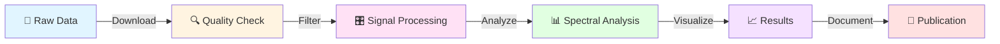

<div align="center">

# 🌍 Seismological Data Analysis


[](https://www.linux.org/)
[](https://www.python.org/)
[](https://git-scm.com/)
[](LICENSE)

**Hands-on codes, workflows, and assignments for NGPD510 – Seismological Data Analysis**

*All analysis performed using Ubuntu Linux terminal with reproducible, research-oriented workflows*

[Getting Started](#-getting-started) • [Documentation](#-repository-structure) • [Tools](#-tools--technologies) • [Contributing](#-contributing)

---

</div>

## 🎯 Objectives

<table>
<tr>
<td width="50%">

### 🔬 Technical Skills
- 🖥️ Master **command-line** seismic data analysis
- 📊 Process waveforms from raw seismic records
- 🎛️ Apply advanced **filtering & spectral analysis**
- 🔧 Implement professional signal processing techniques

</td>
<td width="50%">

### 📚 Research Capabilities
- 📝 Build **reproducible workflows** for publications
- 🔄 Maintain clean **version control** practices
- 🧪 Develop research-grade analysis pipelines
- 🌐 Collaborate using modern development tools

</td>
</tr>
</table>

---

## 🛠 Tools & Technologies

<div align="center">

| Category | Technologies |
|:--------:|:------------|
| **🖥️ Operating System** |  Linux Terminal |
| **📊 Seismic Analysis** |  Seismic Analysis Code |
| **🐍 Python Stack** |     |
| **⚙️ Scripting** |  Shell Scripting |
| **🗺️ Mapping** |  Generic Mapping Tools |
| **🔧 Version Control** |   |

</div>

---

## 📂 Repository Structure

```
📦 seismological-data-analysis
┣ 📂 assignments/          # Course assignments and solutions
┃ ┣ 📂 assignment-01/
┃ ┣ 📂 assignment-02/
┃ ┗ 📂 ...
┃
┣ 📂 lectures/             # Lecture notes and materials
┃ ┣ 📂 week-01/
┃ ┣ 📂 week-02/
┃ ┗ 📂 ...
┃
┣ 📂 data/                 # Sample seismic datasets
┃ ┣ 📂 raw/
┃ ┣ 📂 processed/
┃ ┗ 📂 examples/
┃
┣ 📂 scripts/              # Analysis scripts and tools
┃ ┣ 📂 python/
┃ ┣ 📂 bash/
┃ ┗ 📂 sac/
┃
┣ 📂 notebooks/            # Jupyter notebooks for tutorials
┃ ┣ 📓 01_introduction.ipynb
┃ ┣ 📓 02_data_processing.ipynb
┃ ┗ 📓 ...
┃
┣ 📂 docs/                 # Documentation and guides
┃ ┣ 📄 installation.md
┃ ┣ 📄 workflow_guide.md
┃ ┗ 📄 best_practices.md
┃
┣ 📂 results/              # Analysis outputs and figures
┃ ┣ 📂 figures/
┃ ┗ 📂 reports/
┃
┣ 📄 README.md
┣ 📄 LICENSE
┣ 📄 .gitignore
┗ 📄 requirements.txt
```

---

## 🚀 Getting Started

### Prerequisites

```bash
# Install required system packages
sudo apt update
sudo apt install -y python3 python3-pip git

# Install SAC (Seismic Analysis Code)
# Follow instructions from IRIS: https://ds.iris.edu/ds/nodes/dmc/software/downloads/sac/
```

### Installation

```bash
# Clone the repository
git clone https://github.com/yourusername/seismological-data-analysis.git
cd seismological-data-analysis

# Install Python dependencies
pip install -r requirements.txt

# Verify installation
python3 -c "import obspy; print(f'ObsPy version: {obspy.__version__}')"
```

---

## 💡 Key Features

<div align="center">

| Feature | Description |
|:-------:|:------------|
| 🎓 | **Educational Focus** – Structured for learning and teaching |
| 🔄 | **Reproducible** – All workflows documented and version-controlled |
| 📊 | **Publication-Ready** – Research-grade analysis pipelines |
| 🌐 | **Open Source** – Community-driven development |
| 📚 | **Well-Documented** – Comprehensive guides and examples |

</div>

---

## 📈 Workflow Overview



---

## 📖 Course Topics

<details>
<summary><b>Week 1-2: Foundations</b></summary>

- Introduction to seismology and data formats
- Linux command-line fundamentals
- Git version control basics
- SAC installation and setup

</details>

<details>
<summary><b>Week 3-4: Data Acquisition</b></summary>

- Accessing seismic data archives (IRIS, FDSN)
- Understanding SEED and miniSEED formats
- Metadata and station information
- ObsPy data retrieval

</details>

<details>
<summary><b>Week 5-6: Signal Processing</b></summary>

- Time-series analysis
- Filtering techniques (bandpass, highpass, lowpass)
- Detrending and decimation
- Instrument response removal

</details>

<details>
<summary><b>Week 7-8: Spectral Analysis</b></summary>

- Fourier transforms
- Power spectral density
- Spectrograms
- Time-frequency analysis

</details>

<details>
<summary><b>Week 9-10: Advanced Topics</b></summary>

- Event detection and picking
- Earthquake location
- Focal mechanisms
- Advanced visualization with GMT

</details>

---

## 🤝 Contributing

Contributions are welcome! Please feel free to submit a Pull Request.

1. Fork the repository
2. Create your feature branch (`git checkout -b feature/AmazingFeature`)
3. Commit your changes (`git commit -m 'Add some AmazingFeature'`)
4. Push to the branch (`git push origin feature/AmazingFeature`)
5. Open a Pull Request

---

## 📄 License

This project is licensed under the MIT License - see the [LICENSE](LICENSE) file for details.

---

## 📧 Contact

**Course Instructor** – [Your Name](mailto:your.email@university.edu)

**Project Link** – [https://github.com/yourusername/seismological-data-analysis](https://github.com/yourusername/seismological-data-analysis)

---

<div align="center">

### ⭐ Star this repository if you find it helpful!


**Made with ❤️ for the seismology community**


</div>
