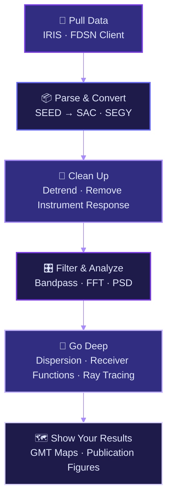

<div align="center">


<br/>

<p align="center">
  
  
  
  
  
  
  
</p>

<p align="center">
  
  
  
  
</p>


### 🎓 Hands-on Codes, Workflows & Assignments
*Everything from pulling waveforms off IRIS to ray-tracing through the mantle — done right in the terminal.*

<br/>

[](#-objectives)
[](#-tools--tech-stack)
[](#-modules)
[](#-getting-started)

</div>

---

<br/>

## 🎯 Objectives

<div align="center">

<table>
<tr>
<td align="center" width="33%">


### 🖥️ Own the Terminal
No GUIs, no hand-holding. Learn to do everything — fetching data, processing waveforms, generating figures — straight from the command line.

</td>
<td align="center" width="33%">


### 🌊 Process Real Waveforms
Not toy data. Work with actual seismograms — filter them, pull out instrument effects, dig into their spectral structure.

</td>
<td align="center" width="33%">


### 🔁 Write It Once, Run It Forever
Scripts that actually work next time you run them. Reproducible pipelines, version-controlled, properly documented.

</td>
</tr>
</table>

</div>

<div align="center">

</div>

---

<br/>

## 🛠️ Tools & Tech Stack

<div align="center">

### 💻 Core Stack

<table>
<tr>
<td align="center" width="16%">

<br><b>Python</b>
<br><sub>ObsPy · NumPy · SciPy</sub>
</td>
<td align="center" width="16%">

<br><b>Ubuntu Linux</b>
<br><sub>Terminal Workflow</sub>
</td>
<td align="center" width="16%">

<br><b>MATLAB</b>
<br><sub>Signal Processing</sub>
</td>
<td align="center" width="16%">

<br><b>Fortran</b>
<br><sub>CPS Codes</sub>
</td>
<td align="center" width="16%">

<br><b>Git & GitHub</b>
<br><sub>Version Control</sub>
</td>
<td align="center" width="16%">

<br><b>Bash</b>
<br><sub>Shell Scripting</sub>
</td>
</tr>
</table>

### 🔬 Seismology Tools We Actually Use

<table>
<tr>
<td align="center" width="25%">
<b>SAC</b>
<br><sub>Seismic Analysis Code — bread & butter for waveform work</sub>
</td>
<td align="center" width="25%">
<b>TauP</b>
<br><sub>Ray tracing, phase arrivals, travel times</sub>
</td>
<td align="center" width="25%">
<b>PQLX</b>
<br><sub>Station noise & data quality checks</sub>
</td>
<td align="center" width="25%">
<b>GMT</b>
<br><sub>Maps that actually look good</sub>
</td>
</tr>
</table>

### 📦 Python Imports You'll See Everywhere

```python
import obspy          # Seismic data — read, process, plot
import numpy          # The numerical backbone
import scipy          # Filtering, FFTs, signal magic
import matplotlib     # Visualization (when GMT is overkill)
```


</div>

<div align="center">

</div>

---

<br/>

## 📚 Modules

> How I've structured the work in this repo. Each folder maps to a chunk of the actual pipeline — start to finish.

<br/>

<details>
<summary><h3>🟣 Module 1 — Foundations & Environment Setup</h3></summary>
<br/>

This is where everything begins. No seismology yet — just getting comfortable with the tools we'll use for the rest of the semester.

- 🖥️ **Linux & Terminal Basics** — navigation, permissions, file handling, the stuff you actually use daily
- ⚙️ **Bash Scripting** — loops, variables, automating repetitive tasks so you stop doing them by hand
- 📊 **MATLAB Kickstart** — workspace, arrays, writing quick scripts for signal tasks
- 🔀 **Git Workflow** — branching, committing, keeping this repo sane as it grows

</details>

<br/>

<details>
<summary><h3>🔵 Module 2 — Getting Seismic Data</h3></summary>
<br/>

Can't process what you don't have. This module is all about pulling real data from the archives and understanding what you're actually looking at.

- 🌐 **IRIS Data Management Center** — how to actually request data, what the station codes mean, FDSN services
- 📦 **Seismic Data Formats** — SEED, miniSEED, SEGY, SAC — what's different, when to use which, how to convert
- 🐍 **ObsPy Data Clients** — scripting your downloads instead of clicking buttons
- ✅ **Quick Quality Checks** — making sure what you downloaded is actually usable before you spend an hour processing garbage

</details>

<br/>

<details>
<summary><h3>🟢 Module 3 — Signal Processing</h3></summary>
<br/>

Raw seismograms are messy. This is where we clean them up and make them actually useful.

- 🧹 **Preprocessing** — detrend, demean, taper — the stuff everyone skips and then wonders why their results look wrong
- 🔧 **Instrument Response Removal** — the seismometer's fingerprint on your data, and how to take it off using RESP files & deconvolution
- 🎛️ **Filtering** — bandpass, highpass, lowpass. Butterworth, Chebyshev. Know when to use which
- 📐 **Transfer Functions** — what RESP files and dataless SEED actually contain, and why they matter

</details>

<br/>

<details>
<summary><h3>🟡 Module 4 — Spectral & Frequency Analysis</h3></summary>
<br/>

Time domain is great, but a lot of the interesting stuff lives in frequency space.

- 🌊 **Fourier Analysis** — FFT, windowing, why it matters for seismic signals
- 📈 **Power Spectral Density** — noise floors, signal-to-noise, station characterization with PQLX
- 🎼 **Time-Frequency Analysis** — spectrograms, wavelet transforms — watching frequency content evolve over time
- 📊 **Noise vs Signal** — what's actually noise, what's signal, and how to tell them apart

</details>

<br/>

<details>
<summary><h3>🔴 Module 5 — Advanced Seismology</h3></summary>
<br/>

The big stuff. Locating earthquakes, imaging the crust, tracing rays through velocity models — this is where it all comes together.

- 📍 **Earthquake Locations & Focal Mechanisms** — hypocenter determination, moment tensors, beach balls
- 🌊 **Surface Wave Dispersion** — extracting phase & group velocity from earthquakes and ambient noise cross-correlations
- 🛰️ **Receiver Functions & Stacking** — H-κ stacking for crustal thickness, CCP stacking to image the Moho
- 🚀 **Ray Tracing with TauP** — predicting arrivals, plotting ray paths, velocity models
- 💻 **CPS (Computer Programs in Seismology)** — Herrmann's suite for dispersion inversion, velocity analysis, and more
- 🗺️ **Mapping & Visualization** — GMT for publication-quality seismological maps

</details>

<div align="center">

</div>

---

<br/>

## 💡 What You'll Walk Away With

<div align="center">

<table>
<tr>
<td align="center" width="25%">


### 🔥 Real Workflows
Not toy examples. Pipelines that work on actual IRIS data.

</td>
<td align="center" width="25%">


### 🚀 Reproducible
Run it again six months later. It still works. That's the point.

</td>
<td align="center" width="25%">


### 📚 Terminal Native
Everything in the command line. No black boxes, no mystery buttons.

</td>
<td align="center" width="25%">


### 🌐 Open & Shareable
MIT licensed. Fork it, use it, build on it.

</td>
</tr>
</table>

</div>

<div align="center">

</div>

---

<br/>

## 📊 The Pipeline at a Glance

<div align="center">



</div>

<div align="center">

</div>

---

<br/>

## 🚀 Getting Started

### 1️⃣ Clone

```bash
git clone https://github.com/yourusername/seismological-data-analysis.git
cd seismological-data-analysis
```

### 2️⃣ Python Dependencies

```bash
pip install obspy numpy scipy matplotlib
```

### 3️⃣ Verify

```bash
python3 -c "import obspy; print(f'ObsPy {obspy.__version__} — good to go')"
```

### 4️⃣ Install SAC

Grab it from IRIS, then point your shell at it:

```bash
# After downloading from https://ds.iris.edu/ds/nodes/dmc/software/downloads/sac/
export SACAUX=/path/to/sac/aux
source /path/to/sac/bin/sacenv.sh
```

### 5️⃣ You're In 🎉

```bash
sac                                    # open SAC interactively
python3 scripts/your_first_script.py   # or run a script
```

<div align="center">

| What you need | Version |
|:--|:--:|
| Ubuntu | 22.04+ |
| Python | 3.8+ |
| Git | 2.0+ |
| SAC | Latest |

</div>

<div align="center">

</div>

---

<br/>

## 📖 Reading List

Not everything here is cover-to-cover reading — but keep these handy while you work through the modules.

<div align="center">

| 📘 Book | Why it's useful |
|:--|:--|
| Shearer — *Introduction to Seismology* | The go-to reference. Clear, no fluff |
| Lowrie — *Fundamentals of Geophysics* | Broader context when you need the bigger picture |
| Herrmann — *Computer Programs in Seismology* (2013) | The paper behind CPS — worth reading before Module 5 |
| Gubbins — *Seismology and Plate Tectonics* | Good for understanding the tectonic setting |

</div>

<div align="center">

</div>

---

<br/>

## 🤝 Contributing

Found a bug in one of the scripts? Got a better way to do something? Open a PR.

<div align="center">

<table>
<tr>
<td align="center" width="33%">


### 🍴 Fork It

</td>
<td align="center" width="33%">


### ✏️ Make Your Change

</td>
<td align="center" width="33%">


### 📤 Push It Back

</td>
</tr>
</table>

</div>

```bash
git checkout -b fix/your-thing
git commit -m "fix: describe what you changed"
git push origin fix/your-thing
# → open a PR
```

<div align="center">

</div>

---

<br/>

## 📫 Resources & Links

<div align="center">

<p>
<a href="https://ds.iris.edu/ds/nodes/dmc/">

</a>
<a href="https://docs.obspy.org/">

</a>
<a href="https://ds.iris.edu/files/sac-manual/">

</a>
<a href="https://docs.generic-mapping-tools.org/">

</a>
<a href="https://docs.obspy.org/packages/autodoc/taup.html">

</a>
</p>

</div>

---

<br/>

## 📄 License

MIT — see [`LICENSE`](LICENSE)

---

<div align="center">

<br/>


&nbsp;&nbsp;

&nbsp;&nbsp;


<br/><br/>


<br/><br/>


<br/>

### 💜 Made with passion for the Seismology Community


</div>
