<div align="center">

<!-- Animated Header -->


<!-- Typing Animation -->


<br/>

<!-- Core Badges Row -->
<p align="center">
  
  
  
  
  
</p>

<!-- Tech Stack Badges -->
<p align="center">
  
  
  
  
  
  
  
</p>

<!-- Animated Divider -->


</div>

---

<div align="center">

> **NGPD510 — Seismological Data Analysis**
> A hands-on, terminal-driven course for seismic signal processing, data acquisition, spectral analysis, and advanced geophysical techniques — built for reproducible research workflows.

</div>

---

<br/>

## 📍 Quick Navigation

<div align="center">

| Section | Jump |
|:--|:--|
| 🎯 Course Objectives | [`→ Objectives`](#-course-objectives) |
| 🛠️ Tools & Stack | [`→ Tools`](#-tools--tech-stack) |
| 📚 9-Unit Curriculum | [`→ Curriculum`](#-semester-curriculum) |
| 📊 Workflow Pipeline | [`→ Workflow`](#-workflow-pipeline) |
| 🚀 Setup Guide | [`→ Getting Started`](#-getting-started) |
| 📖 References | [`→ References`](#-references--textbooks) |

</div>

---

<br/>

## 🎯 Course Objectives

<div align="center">

<table>
<tr>
<td align="center" width="33%">

### 🖥️ Master Terminal Environments
Command-line seismic data handling on **Ubuntu Linux** — from file system navigation to full Bash scripting pipelines

</td>
<td align="center" width="33%">

### 📡 Handle Digital Seismic Data
Acquire, edit, manipulate & filter real-world seismograms using **professional-grade tools** like SAC, ObsPy & PQLX

</td>
<td align="center" width="33%">

### 📝 Build Research Workflows
Reproducible, publication-ready analysis pipelines with **Git version control**, structured scripts & documented outputs

</td>
</tr>
</table>

</div>

> **Course Statement:** *(from official syllabus)*
> This course offers hands-on experience with a variety of seismological analysis techniques using Linux / Bash / Fortran / MATLAB / Python. The goal is to give each student a working knowledge of techniques and programs commonly used in seismology — helpful for both carrying out research and using the products of these analyses (earthquake locations, receiver functions, tomographic models).

---

<br/>

## 🛠️ Tools & Tech Stack

<div align="center">

### 💻 Core Environments & Languages

<table>
<tr>
<td align="center" width="20%">

<br><b>Python 3.8+</b>
<br><sub>ObsPy · NumPy · SciPy · Matplotlib</sub>
</td>
<td align="center" width="20%">

<br><b>Ubuntu 22.04+</b>
<br><sub>Terminal-Based Workflow</sub>
</td>
<td align="center" width="20%">

<br><b>MATLAB</b>
<br><sub>Signal Processing</sub>
</td>
<td align="center" width="20%">

<br><b>Fortran</b>
<br><sub>CPS Codes</sub>
</td>
<td align="center" width="20%">

<br><b>Git & GitHub</b>
<br><sub>Version Control</sub>
</td>
</tr>
</table>

### 🔬 Seismology-Specific Tools

| Tool | Purpose |
|:--|:--|
| **SAC** (Seismic Analysis Code) | Core waveform processing & visualization |
| **ObsPy** | Python-based seismic data I/O & processing |
| **PQLX** | Station noise characterization & data quality |
| **TauP** | Ray tracing & seismic phase arrival computation |
| **CPS** (Computer Programs in Seismology) | Dispersion, receiver functions, velocity models |
| **GMT** (Generic Mapping Tools) | Publication-quality seismological maps |
| **IRIS FDSN** | Global seismic data acquisition & archival |

### 📦 Python Ecosystem

```python
import obspy          # Seismic I/O, processing, visualization
import numpy          # Numerical arrays & linear algebra
import scipy          # Signal processing & spectral analysis
import matplotlib     # 2D plotting & figure creation
```

</div>

---

<br/>

## 📚 Semester Curriculum

> **42 lecture hours · 9 active units + revision**
> Each unit below maps directly to the official NGPD510 syllabus.

---

<details>
<summary><h3>🟣 Unit 1 &nbsp;— &nbsp;Foundations: Linux, Bash & MATLAB &nbsp;<code>04 hrs</code></h3></summary>
<br/>

**Learning Outcome:** Build fluency in Linux/Unix environments, shell scripting, and MATLAB basics.

- 🖥️ **Introduction to Unix / Linux** — OS architecture, terminal navigation, file permissions
- ⚙️ **Bash Shell Scripting** — variables, loops, conditionals, automation scripts
- 📊 **Introduction to MATLAB** — workspace, arrays, basic plotting, script vs. function files

</details>

---

<details>
<summary><h3>🔵 Unit 2 &nbsp;— &nbsp;Seismic Data Formats & Digital Seismograms &nbsp;<code>04 hrs</code></h3></summary>
<br/>

**Learning Outcome:** Understand and handle standard seismic data formats professionally.

- 📦 **Seismic Data Formats** — SEED, miniSEED, SEGY, SAC — structure & conversion
- 🌐 **Digital Seismogram Processing** — reading, parsing & writing waveform files
- 🔄 **Format Interoperability** — tools for format conversion and metadata extraction

</details>

---

<details>
<summary><h3>🟢 Unit 3 &nbsp;— &nbsp;Instrument Response Removal &nbsp;<code>04 hrs</code></h3></summary>
<br/>

**Learning Outcome:** Understand and computationally remove instrument effects from raw seismograms.

- 📐 **Theory of Instrument Response** — transfer functions, poles & zeros
- 🔧 **Deconvolution Methods** — spectral division, water-level stabilization
- 📄 **RESP & dataless SEED** — parsing and applying response metadata
- ✅ **Calibration & Validation** — ground motion units (displacement, velocity, acceleration)

</details>

---

<details>
<summary><h3>🟡 Unit 4 &nbsp;— &nbsp;Spectral Analysis & Filtering &nbsp;<code>04 hrs</code></h3></summary>
<br/>

**Learning Outcome:** Apply frequency-domain analysis and design digital filters for seismograms.

- 🌊 **Spectral Analysis** — FFT, power spectral density, windowing functions
- 🎛️ **Filtering Techniques** — bandpass, highpass, lowpass, Butterworth, Chebyshev
- 📂 **Seismograph Transfer Functions** — working with RESP files and dataless SEED
- 📈 **Signal-to-Noise Ratio** — noise floor estimation & SNR optimization

</details>

---

<details>
<summary><h3>🟠 Unit 5 &nbsp;— &nbsp;IRIS Data Center & SAC &nbsp;<code>05 hrs</code></h3></summary>
<br/>

**Learning Outcome:** Retrieve real seismic data from global archives and process with SAC.

- 🌐 **IRIS DMC Access** — FDSN web services, data request formats, network/station codes
- 🔍 **Intro to SAC** — interactive mode, macro scripting, waveform display
- 📥 **Automated Data Downloads** — ObsPy FDSN Client, quality-controlled retrieval
- 🗄️ **Data Management** — organizing, naming conventions, reproducible pipelines

</details>

---

<details>
<summary><h3>🔴 Unit 6 &nbsp;— &nbsp;Data Quality, Locations & Focal Mechanisms &nbsp;<code>05 hrs</code></h3></summary>
<br/>

**Learning Outcome:** Assess data quality, locate earthquakes, and determine source characteristics.

- 📊 **Data Quality Assessment** — PQLX noise characterization, station performance metrics
- 📍 **Earthquake Locations** — hypocenter determination, velocity models, residual minimization
- 🎯 **Focal Mechanism Determination** — moment tensors, beach ball diagrams, fault plane solutions

</details>

---

<details>
<summary><h3>🟤 Unit 7 &nbsp;— &nbsp;Surface Wave Dispersion &nbsp;<code>04 hrs</code></h3></summary>
<br/>

**Learning Outcome:** Extract dispersion curves from both ambient noise and earthquake records.

- 🌊 **Ambient Noise Surface Waves** — cross-correlation, noise-based Green's functions
- 📈 **Phase Velocity Dispersion** — frequency-time analysis, phase picking
- 📉 **Group Velocity Dispersion** — group delay estimation from earthquake seismograms
- 🗺️ **Tomographic Imaging** — lateral velocity variation mapping

</details>

---

<details>
<summary><h3>⚫ Unit 8 &nbsp;— &nbsp;Tomography, Receiver Functions & Stacking &nbsp;<code>04 hrs</code></h3></summary>
<br/>

**Learning Outcome:** Compute receiver functions and image subsurface structure via stacking techniques.

- 🔬 **Seismic Tomography** — travel-time inversions, crustal & mantle velocity models
- 🛰️ **Receiver Function Computation** — iterative time-domain deconvolution
- 📐 **H-κ Stacking** — crustal thickness & Poisson's ratio estimation
- 🗻️ **CCP Stacking** — common conversion point imaging, Moho mapping

</details>

---

<details>
<summary><h3>💜 Unit 9 &nbsp;— &nbsp;Velocity Analysis, Ray Tracing & CPS &nbsp;<code>06 hrs</code></h3></summary>
<br/>

**Learning Outcome:** Perform ray tracing, measure exotic arrivals, and use Herrmann's CPS codes.

- 🚀 **Ray Tracing with TauP** — arrival time prediction, phase identification, ray geometry
- 📏 **Velocity Analysis** — Vp/Vs estimation, velocity structure refinement
- 🎯 **SsPmP Arrivals** — processing & measuring post-critical reflections
- 💻 **Computer Programs in Seismology (CPS)** — Herrmann's suite for dispersion & RF analysis

</details>

---

<details>
<summary><h3>🔁 Unit 10 &nbsp;— &nbsp;Course Revision &nbsp;<code>02 hrs</code></h3></summary>
<br/>

**Learning Outcome:** Consolidate all topics and prepare for comprehensive assessment.

- 📝 Full-course topic review & Q&A
- 🧩 Integration exercises combining Units 1–9

</details>

---

<br/>

## 📊 Workflow Pipeline

```mermaid
%%{init: {'theme':'dark', 'themeVariables': {'primaryColor':'#7c3aed','primaryTextColor':'#fff','primaryBorderColor':'#a78bfa','lineColor':'#a78bfa','secondaryColor':'#6366f1','tertiaryColor':'#312e81'}}}%%

graph LR
    subgraph ACQ ["📡 Acquisition"]
        A[IRIS / FDSN\nData Request]
    end

    subgraph FMT ["📦 Formats"]
        B[SEED · SEGY · SAC\nConversion & Parsing]
    end

    subgraph PRE ["🧹 Preprocessing"]
        C[Detrend · Demean\nInstrument Response Removal]
    end

    subgraph SIG ["🎛️ Signal Processing"]
        D[Bandpass · Highpass\nLowpass Filtering]
    end

    subgraph SPEC ["📈 Spectral Analysis"]
        E[FFT · PSD\nTime-Freq Analysis]
    end

    subgraph ADV ["🔬 Advanced"]
        F[Receiver Functions\nDispersion · Tomography\nTauP Ray Tracing]
    end

    subgraph OUT ["📝 Output"]
        G[Publication Figures\nGMT Maps · Reports]
    end

    ACQ --> FMT --> PRE --> SIG --> SPEC --> ADV --> OUT

    style ACQ fill:#312e81,stroke:#7c3aed,color:#fff
    style FMT fill:#1e1b4b,stroke:#6366f1,color:#fff
    style PRE fill:#312e81,stroke:#a78bfa,color:#fff
    style SIG fill:#1e1b4b,stroke:#7c3aed,color:#fff
    style SPEC fill:#312e81,stroke:#a78bfa,color:#fff
    style ADV fill:#1e1b4b,stroke:#c4b5fd,color:#fff
    style OUT fill:#312e81,stroke:#ddd6fe,color:#fff
```

<div align="center">



</div>

---

<br/>

## 🚀 Getting Started

### ⚡ 1. Clone the Repository

```bash
git clone https://github.com/yourusername/seismological-data-analysis.git
cd seismological-data-analysis
```

### 📦 2. Install Python Dependencies

```bash
pip install obspy numpy scipy matplotlib
```

### ✅ 3. Verify ObsPy

```bash
python3 -c "import obspy; print(f'ObsPy {obspy.__version__} — ready')"
```

### 🔧 4. Install SAC

Download & install from the official IRIS page:
> 👉 [https://ds.iris.edu/ds/nodes/dmc/software/downloads/sac/](https://ds.iris.edu/ds/nodes/dmc/software/downloads/sac/)

Set up your environment variable:

```bash
export SACAUX=/path/to/sac/aux
source /path/to/sac/bin/sacenv.sh
```

### 🛰️ 5. Install TauP

```bash
pip install obspy   # TauP is bundled with ObsPy
python3 -c "from obspy.taup import TauP_travel_time; print('TauP ready')"
```

### 📋 Prerequisites Summary

| Requirement | Minimum Version |
|:--|:--|
| OS | Ubuntu 22.04+ |
| Python | 3.8+ |
| Git | 2.0+ |
| SAC | Latest (2023+) |
| MATLAB | R2021a+ *(optional)* |

---

<br/>

## 📖 References & Textbooks

### 📘 Primary Textbooks

| # | Authors | Title | Year | Publisher |
|:--:|:--|:--|:--:|:--|
| 1 | R. B. Herrmann | Computer Programs in Seismology: An Evolving Tool for Instruction and Research | 2013 | *Seism. Res. Lett.* 84, 1081–1088 |
| 2 | U. Agustin | Principles of Seismology | 2000 | Cambridge University Press |

### 📗 Reference Books

| # | Authors | Title | Year | Publisher |
|:--:|:--|:--|:--:|:--|
| 1 | P. Shearer | Introduction to Seismology | 1999 | Cambridge University Press |
| 2 | W. Lowrie | Fundamentals of Geophysics | 2007 | Cambridge University Press |
| 3 | D. Gubbins | Seismology and Plate Tectonics | 1990 | Cambridge University Press |

### 🌐 Online Resources

<p align="center">

[](https://ds.iris.edu/ds/nodes/dmc/)
[](https://docs.obspy.org/)
[](https://ds.iris.edu/files/sac-manual/)
[](https://docs.generic-mapping-tools.org/)
[](https://docs.obspy.org/packages/autodoc/taup.html)
[](http://www.cps.mtu.edu/cgi-bin/livewin/cps.cgi)

</p>

---

<br/>

## 🤝 Contributing

Contributions, bug fixes, and new notebooks are welcome!

```bash
# 1. Fork & clone
git clone https://github.com/yourusername/seismological-data-analysis.git

# 2. Create a feature branch
git checkout -b feature/your-feature-name

# 3. Commit with a clear message
git add .
git commit -m "feat: add Unit-X exercise on [topic]"

# 4. Push & open a Pull Request
git push origin feature/your-feature-name
```

---

<br/>

## 📄 License

This project is licensed under the **MIT License** — see [`LICENSE`](LICENSE) for details.

---

<div align="center">

<br/>

<!-- Stats -->

&nbsp;

&nbsp;


<br/><br/>

<!-- Visitor Badge -->


<br/><br/>

<!-- Footer -->


<sub>💜 Built for the Seismology Community · NGPD510 Spring 2026</sub>

</div>
